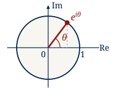
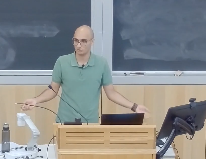

<header id="header">

<h1 class="header-title">MAT290: Advanced Engineering Mathematics</h1>

University of Toronto &middot; St. George

Fall 2026 &middot; LEC0101

</header>

This course develops the tools of ordinary differential equations, Laplace transforms and complex analysis. We study the behaviour of solutions, complex differentiability, contour integrals, series and residues.

<ul class="quick-links">
<li><a href="#schedule">Course schedule</a></li>
<li><a href="#quizzes">Quiz dates</a></li>
<li><a href="syllabus.html">Syllabus and policies</a></li>
<li><a href="https://q.utoronto.ca/courses/469114">Quercus</a></li>
</ul>

::: {#staff .sec}

## Course Staff

<figure class="instructorphoto"></figure>

<h3><a href="https://erfanmeskar.github.io/">Erfan Meskar</a></h3>

Instructor &middot; LEC0101 <a href="mailto:e.meskar@utoronto.ca">e.meskar@utoronto.ca</a>

Other sections: Manfredi Maggiore and Adrian Nachman.

:::

::: {.sechighlight}

::: {#logistics .sec}

## Logistics

<ul class="logistics-list">
<li><strong>Lectures &middot; LEC0101:</strong> Monday 5&ndash;6 PM, Wednesday 3&ndash;4 PM, Thursday 5&ndash;6 PM. All meetings are in <strong>SF1101</strong>.</li>
<li><strong>Lecture dates:</strong> September 9&ndash;December 8, 2026. No lectures on October 12, 26, 28 or 29. <strong>Make-up lecture:</strong> Tuesday, December 8, 5&ndash;6 PM.</li>
<li><strong>Office hours:</strong> see your section on <a href="https://q.utoronto.ca/courses/469114">Quercus</a>.</li>
<li><strong>Email:</strong> use <strong>MAT290</strong> in the subject.</li>
<li><strong>Tutorials:</strong> two hours weekly, beginning the week of September 21. Check the <a href="https://www.control.utoronto.ca/people/profs/maggiore/MAT290F.php">official syllabus</a> for your assigned rooms and room exceptions.</li>
<li><strong>Recordings:</strong> none provided.</li>
</ul>

All times are Toronto local time.

:::

:::

::: {#coursework .sec}

## Coursework

<table class="table assessment-table">
<thead><tr><th scope="col">Assessment</th><th scope="col">Weight</th></tr></thead>
<tbody>
<tr><th scope="row">Five quizzes</th><td>50% combined</td></tr>
<tr><th scope="row">Final examination</th><td>50%</td></tr>
<tr><th scope="row">Weekly homework</th><td>Practice; ungraded</td></tr>
</tbody>
</table>

<strong>Passing requirement:</strong> the final exam is mandatory; a score below 40% results in a course grade of 49% under the official syllabus.

### Quiz Dates {#quizzes}

<table class="table quiz-table">
<caption>2026 quiz timetable &middot; Toronto time</caption>
<thead><tr><th scope="col">Quiz</th><th scope="col">Thursday</th><th scope="col">Time</th><th scope="col">Location</th></tr></thead>
<tbody>
<tr><th scope="row">1</th><td>October 1</td><td>2&ndash;3 PM</td><td>Your Thursday tutorial room</td></tr>
<tr><th scope="row">2</th><td>October 15</td><td>2&ndash;3 PM</td><td>Your Thursday tutorial room</td></tr>
<tr><th scope="row">3</th><td>November 5</td><td>2&ndash;3 PM</td><td>Your Thursday tutorial room</td></tr>
<tr><th scope="row">4</th><td>November 19</td><td>2&ndash;3 PM</td><td>Your Thursday tutorial room</td></tr>
<tr><th scope="row">5</th><td>December 3</td><td>2&ndash;3 PM</td><td>Your Thursday tutorial room</td></tr>
</tbody>
</table>

For coverage, consult Quercus. Each quiz includes an assigned homework problem. See the <a href="syllabus.html">syllabus page</a> for aids, regrades and missed assessments.

:::

::: {#materials .sec}

## Course Materials

<ul class="resource-list">
<li><strong>Required textbook:</strong> Dennis G. Zill, <em>Advanced Engineering Mathematics</em>, 7th edition, Jones &amp; Bartlett Learning.</li>
<li><strong>ODE notes:</strong> <a href="https://q.utoronto.ca/courses/469114/files/44558530?wrap=1">Ordinary differential equations</a>.</li>
<li><strong>Inverse Laplace Transform notes:</strong> <a href="https://q.utoronto.ca/courses/469114/files/44487707?wrap=1">Inverse Laplace transform</a></li>
<li><strong>Supplementary</strong> material: see the <a href="#schedule">Supplementary Material column</a> below for supplementary videos and notes.</li>
<li><strong>Lecture worksheets:</strong> see the <a href="#schedule">Lecture Worksheet column</a> below.</li>
<li><strong>Announcements:</strong> check <a href="https://q.utoronto.ca/courses/469114">Quercus</a>.</li>
<li><a href="files/MAT290-Fall2026-Course-Schedule.pdf">Download the shared course schedule (PDF)</a>.</li>
</ul>

The notes links in the shared schedule require Quercus access. If a linked file is unavailable to you, find the corresponding notes in your own section.

<!-- Worksheet PDFs use worksheet/ws-L01.pdf through worksheet/ws-L36.pdf. -->

:::

## Course Schedule

The schedule is tentative; individual sections may progress at slightly different rates. Lecture numbers below follow the shared schedule rather than fixed calendar weeks.

<!-- 
Worksheet links open only during their corresponding lecture. Each worksheet's date and time are shown below, in <strong>Toronto time</strong>. There are no lectures on October 12 or during the reading-week break on October 26, 28 and 29. The final lecture is a <strong>make-up lecture on Tuesday, December 8, 5&ndash;6 PM</strong>.
 -->

**Complete the assigned problems before your tutorial.** Homework is ungraded practice for the quizzes and final examination. Unless labelled as ODE notes, all readings and problem numbers refer to **Zill, 7th edition**. The 6th edition has different numbering and omits some of these problems.

<!-- Keep lecture groupings and homework numbers aligned with the shared PDF. -->
<table class="table schedule-table" role="table">
<caption>Lectures 1&ndash;36 &middot; readings and homework</caption>
<colgroup><col class="lectures-col"><col class="topics-col"><col class="readings-col"><col class="homework-col"><col class="worksheet-col"><col class="supplementary-col"></colgroup>
<thead><tr><th scope="col">Lectures</th><th scope="col">Topics</th><th scope="col">Readings</th><th scope="col">Homework assignments</th><th scope="col">Lecture Worksheet</th><th scope="col">Supplementary Material</th></tr></thead>
<tbody>
<tr id="lectures-1-3">
<th scope="row"><a href="#lectures-1-3">1&ndash;3</a></th>
<td data-label="Topics">Unit 1: Complex numbersComplex numbers; complex exponential and logarithm</td>
<td data-label="Readings">Zill: 17.1, 17.2, 17.6</td>
<td data-label="Homework">
<strong>17.1:</strong> 5, 27, 33, 42, 47, 48.

<strong>17.2:</strong> 3, 18, 21, 30, 34, 39.

<strong>17.6:</strong> 11, 17, 24, 32, 38, 47.
</td>
<td data-label="Lecture Worksheet"><ul class="worksheet-links"><li><a class="worksheet-link" href="worksheet/ws-L01.pdf" data-available-from="2026-09-07T09:00:00-04:00" data-available-until="2026-12-29T21:00:00-05:00" aria-describedby="worksheet-time-L01" title="Lecture 1: Wednesday, September 9, 2026, 3–4 PM (Toronto time)">ws-L01</a><time id="worksheet-time-L01" class="worksheet-time" datetime="2026-09-09T15:00:00-04:00">Wed, Sep 9 3–4 PM</time></li><li><a class="worksheet-link" href="worksheet/ws-L02.pdf" data-available-from="2026-09-07T09:00:00-04:00" data-available-until="2026-12-29T21:00:00-05:00" aria-describedby="worksheet-time-L02" title="Lecture 2: Thursday, September 10, 2026, 5–6 PM (Toronto time)">ws-L02</a><time id="worksheet-time-L02" class="worksheet-time" datetime="2026-09-10T17:00:00-04:00">Thu, Sep 10 5–6 PM</time></li><li><a class="worksheet-link" href="worksheet/ws-L03.pdf" data-available-from="2026-09-07T09:00:00-04:00" data-available-until="2026-12-29T21:00:00-05:00" aria-describedby="worksheet-time-L03" title="Lecture 3: Monday, September 14, 2026, 5–6 PM (Toronto time)">ws-L03</a><time id="worksheet-time-L03" class="worksheet-time" datetime="2026-09-14T17:00:00-04:00">Mon, Sep 14 5–6 PM</time></li></ul></td>
<td data-label="Supplementary Material"><!-- Add video or reading links for lectures 1-3 here. -->&mdash;</td>
</tr>
<tr id="lectures-4-6">
<th scope="row"><a href="#lectures-4-6">4&ndash;6</a></th>
<td data-label="Topics">
Complex trigonometric and hyperbolic functions
Unit 2: ODEsIntroduction to ordinary differential equations</td>
<td data-label="Readings">
Zill: 17.7

<a href="https://q.utoronto.ca/courses/469114/files/44558530?wrap=1">ODE notes</a>: 1.1&ndash;1.3
</td>
<td data-label="Homework">
<strong>17.7:</strong> 2, 12, 15, 21, 23, 31.

<strong>Chapter 17 review (p. 862):</strong> 3, 10, 15.
</td>
<td data-label="Lecture Worksheet"><ul class="worksheet-links"><li><a class="worksheet-link" href="worksheet/ws-L04.pdf" data-available-from="2026-09-07T09:00:00-04:00" data-available-until="2026-12-29T21:00:00-05:00" aria-describedby="worksheet-time-L04" title="Lecture 4: Wednesday, September 16, 2026, 3–4 PM (Toronto time)">ws-L04</a><time id="worksheet-time-L04" class="worksheet-time" datetime="2026-09-16T15:00:00-04:00">Wed, Sep 16 3–4 PM</time></li><li><a class="worksheet-link" href="worksheet/ws-L05.pdf" data-available-from="2026-09-07T09:00:00-04:00" data-available-until="2026-12-29T21:00:00-05:00" aria-describedby="worksheet-time-L05" title="Lecture 5: Thursday, September 17, 2026, 5–6 PM (Toronto time)">ws-L05</a><time id="worksheet-time-L05" class="worksheet-time" datetime="2026-09-17T17:00:00-04:00">Thu, Sep 17 5–6 PM</time></li><li><a class="worksheet-link" href="worksheet/ws-L06.pdf" data-available-from="2026-09-07T09:00:00-04:00" data-available-until="2026-12-29T21:00:00-05:00" aria-describedby="worksheet-time-L06" title="Lecture 6: Monday, September 21, 2026, 5–6 PM (Toronto time)">ws-L06</a><time id="worksheet-time-L06" class="worksheet-time" datetime="2026-09-21T17:00:00-04:00">Mon, Sep 21 5–6 PM</time></li></ul></td>
<td data-label="Supplementary Material"><!-- Add video or reading links for lectures 4-6 here. -->&mdash;</td>
</tr>
<tr id="lectures-7-9">
<th scope="row"><a href="#lectures-7-9">7&ndash;9</a></th>
<td data-label="Topics">Existence and uniqueness; equilibria and stability</td>
<td data-label="Readings"><a href="https://q.utoronto.ca/courses/469114/files/44558530?wrap=1">ODE notes</a>: 1.3&ndash;1.5, 2.1</td>
<td data-label="Homework"><strong>ODE notes:</strong> Problems I.1&ndash;I.15 in Section 1.6.</td>
<td data-label="Lecture Worksheet"><ul class="worksheet-links"><li><a class="worksheet-link" href="worksheet/ws-L07.pdf" data-available-from="2026-09-07T09:00:00-04:00" data-available-until="2026-12-29T21:00:00-05:00" aria-describedby="worksheet-time-L07" title="Lecture 7: Wednesday, September 23, 2026, 3–4 PM (Toronto time)">ws-L07</a><time id="worksheet-time-L07" class="worksheet-time" datetime="2026-09-23T15:00:00-04:00">Wed, Sep 23 3–4 PM</time></li><li><a class="worksheet-link" href="worksheet/ws-L08.pdf" data-available-from="2026-09-07T09:00:00-04:00" data-available-until="2026-12-29T21:00:00-05:00" aria-describedby="worksheet-time-L08" title="Lecture 8: Thursday, September 24, 2026, 5–6 PM (Toronto time)">ws-L08</a><time id="worksheet-time-L08" class="worksheet-time" datetime="2026-09-24T17:00:00-04:00">Thu, Sep 24 5–6 PM</time></li><li><a class="worksheet-link" href="worksheet/ws-L09.pdf" data-available-from="2026-09-07T09:00:00-04:00" data-available-until="2026-12-29T21:00:00-05:00" aria-describedby="worksheet-time-L09" title="Lecture 9: Monday, September 28, 2026, 5–6 PM (Toronto time)">ws-L09</a><time id="worksheet-time-L09" class="worksheet-time" datetime="2026-09-28T17:00:00-04:00">Mon, Sep 28 5–6 PM</time></li></ul></td>
<td data-label="Supplementary Material"><!-- Add video or reading links for lectures 7-9 here. -->&mdash;</td>
</tr>
<tr id="lectures-10-12">
<th scope="row"><a href="#lectures-10-12">10&ndash;12</a></th>
<td data-label="Topics">Linear ODEs: solution structure, characteristic polynomials and stability</td>
<td data-label="Readings"><a href="https://q.utoronto.ca/courses/469114/files/44558530?wrap=1">ODE notes</a>: 2.1&ndash;2.4</td>
<td data-label="Homework">
<strong>ODE notes:</strong> Problems II.1&ndash;II.17 in Section 2.5.

<strong>Retrieval practice &middot; Chapter 17 review (p. 862):</strong> 17, 20, 27, 40.
</td>
<td data-label="Lecture Worksheet"><ul class="worksheet-links"><li><a class="worksheet-link" href="worksheet/ws-L10.pdf" data-available-from="2026-09-07T09:00:00-04:00" data-available-until="2026-12-29T21:00:00-05:00" aria-describedby="worksheet-time-L10" title="Lecture 10: Wednesday, September 30, 2026, 3–4 PM (Toronto time)">ws-L10</a><time id="worksheet-time-L10" class="worksheet-time" datetime="2026-09-30T15:00:00-04:00">Wed, Sep 30 3–4 PM</time></li><li><a class="worksheet-link" href="worksheet/ws-L11.pdf" data-available-from="2026-09-07T09:00:00-04:00" data-available-until="2026-12-29T21:00:00-05:00" aria-describedby="worksheet-time-L11" title="Lecture 11: Thursday, October 1, 2026, 5–6 PM (Toronto time)">ws-L11</a><time id="worksheet-time-L11" class="worksheet-time" datetime="2026-10-01T17:00:00-04:00">Thu, Oct 1 5–6 PM</time></li><li><a class="worksheet-link" href="worksheet/ws-L12.pdf" data-available-from="2026-09-07T09:00:00-04:00" data-available-until="2026-12-29T21:00:00-05:00" aria-describedby="worksheet-time-L12" title="Lecture 12: Monday, October 5, 2026, 5–6 PM (Toronto time)">ws-L12</a><time id="worksheet-time-L12" class="worksheet-time" datetime="2026-10-05T17:00:00-04:00">Mon, Oct 5 5–6 PM</time></li></ul></td>
<td data-label="Supplementary Material"><!-- Add video or reading links for lectures 10-12 here. -->&mdash;</td>
</tr>
<tr id="lectures-13-15">
<th scope="row"><a href="#lectures-13-15">13&ndash;15</a></th>
<td data-label="Topics">Unit 3: Laplace transformBasic properties, inverse transforms and translation</td>
<td data-label="Readings">Zill: 4.1, 4.2, 4.3, 4.4</td>
<td data-label="Homework">
<strong>Retrieval practice &middot; Chapter 2 review (p. 104):</strong> 1, 12, 43.

<strong>4.1:</strong> 10, 15, 25, 36, 53.

<strong>4.2:</strong> 9, 15, 23, 33, 39.

<strong>4.3:</strong> 3, 18, 27, 44, 60.
</td>
<td data-label="Lecture Worksheet"><ul class="worksheet-links"><li><a class="worksheet-link" href="worksheet/ws-L13.pdf" data-available-from="2026-09-07T09:00:00-04:00" data-available-until="2026-12-29T21:00:00-05:00" aria-describedby="worksheet-time-L13" title="Lecture 13: Wednesday, October 7, 2026, 3–4 PM (Toronto time)">ws-L13</a><time id="worksheet-time-L13" class="worksheet-time" datetime="2026-10-07T15:00:00-04:00">Wed, Oct 7 3–4 PM</time></li><li><a class="worksheet-link" href="worksheet/ws-L14.pdf" data-available-from="2026-09-07T09:00:00-04:00" data-available-until="2026-12-29T21:00:00-05:00" aria-describedby="worksheet-time-L14" title="Lecture 14: Thursday, October 8, 2026, 5–6 PM (Toronto time)">ws-L14</a><time id="worksheet-time-L14" class="worksheet-time" datetime="2026-10-08T17:00:00-04:00">Thu, Oct 8 5–6 PM</time></li><li><a class="worksheet-link" href="worksheet/ws-L15.pdf" data-available-from="2026-09-07T09:00:00-04:00" data-available-until="2026-12-29T21:00:00-05:00" aria-describedby="worksheet-time-L15" title="Lecture 15: Wednesday, October 14, 2026, 3–4 PM (Toronto time)">ws-L15</a><time id="worksheet-time-L15" class="worksheet-time" datetime="2026-10-14T15:00:00-04:00">Wed, Oct 14 3–4 PM</time></li></ul></td>
<td data-label="Supplementary Material"><!-- Add video or reading links for lectures 13-15 here. -->&mdash;</td>
</tr>
<tr id="lectures-16-18">
<th scope="row"><a href="#lectures-16-18">16&ndash;18</a></th>
<td data-label="Topics">
Laplace transform and LTI systems; Dirac delta function
Unit 4: Complex functions and analyticitySets in the complex plane</td>
<td data-label="Readings">Zill: 4.4, 4.5, 17.3</td>
<td data-label="Homework">
<strong>Retrieval practice &middot; Chapter 3 review (p. 208):</strong> 4, 18, 51.

<strong>4.4:</strong> 3, 27, 42, 48, 68.

<strong>4.5:</strong> 1, 6, 8, 13.

<strong>17.3:</strong> 1, 8, 10, 17, 23.
</td>
<td data-label="Lecture Worksheet"><ul class="worksheet-links"><li><a class="worksheet-link" href="worksheet/ws-L16.pdf" data-available-from="2026-09-07T09:00:00-04:00" data-available-until="2026-12-29T21:00:00-05:00" aria-describedby="worksheet-time-L16" title="Lecture 16: Thursday, October 15, 2026, 5–6 PM (Toronto time)">ws-L16</a><time id="worksheet-time-L16" class="worksheet-time" datetime="2026-10-15T17:00:00-04:00">Thu, Oct 15 5–6 PM</time></li><li><a class="worksheet-link" href="worksheet/ws-L17.pdf" data-available-from="2026-09-07T09:00:00-04:00" data-available-until="2026-12-29T21:00:00-05:00" aria-describedby="worksheet-time-L17" title="Lecture 17: Monday, October 19, 2026, 5–6 PM (Toronto time)">ws-L17</a><time id="worksheet-time-L17" class="worksheet-time" datetime="2026-10-19T17:00:00-04:00">Mon, Oct 19 5–6 PM</time></li><li><a class="worksheet-link" href="worksheet/ws-L18.pdf" data-available-from="2026-09-07T09:00:00-04:00" data-available-until="2026-12-29T21:00:00-05:00" aria-describedby="worksheet-time-L18" title="Lecture 18: Wednesday, October 21, 2026, 3–4 PM (Toronto time)">ws-L18</a><time id="worksheet-time-L18" class="worksheet-time" datetime="2026-10-21T15:00:00-04:00">Wed, Oct 21 3–4 PM</time></li></ul></td>
<td data-label="Supplementary Material"><!-- Add video or reading links for lectures 16-18 here. -->&mdash;</td>
</tr>
<tr id="lectures-19-21">
<th scope="row"><a href="#lectures-19-21">19&ndash;21</a></th>
<td data-label="Topics">Complex functions and complex differentiability</td>
<td data-label="Readings">Zill: 17.4, 17.5</td>
<td data-label="Homework">
<strong>Retrieval practice &middot; Chapter 4 review (p. 266):</strong> 7, 10, 29, 49.

<strong>17.4:</strong> 10, 18, 21, 23, 31, 39.

<strong>17.5:</strong> 1, 3, 10, 15, 25, 32.
</td>
<td data-label="Lecture Worksheet"><ul class="worksheet-links"><li><a class="worksheet-link" href="worksheet/ws-L19.pdf" data-available-from="2026-09-07T09:00:00-04:00" data-available-until="2026-12-29T21:00:00-05:00" aria-describedby="worksheet-time-L19" title="Lecture 19: Thursday, October 22, 2026, 5–6 PM (Toronto time)">ws-L19</a><time id="worksheet-time-L19" class="worksheet-time" datetime="2026-10-22T17:00:00-04:00">Thu, Oct 22 5–6 PM</time></li><li><a class="worksheet-link" href="worksheet/ws-L20.pdf" data-available-from="2026-09-07T09:00:00-04:00" data-available-until="2026-12-29T21:00:00-05:00" aria-describedby="worksheet-time-L20" title="Lecture 20: Monday, November 2, 2026, 5–6 PM (Toronto time)">ws-L20</a><time id="worksheet-time-L20" class="worksheet-time" datetime="2026-11-02T17:00:00-05:00">Mon, Nov 2 5–6 PM</time></li><li><a class="worksheet-link" href="worksheet/ws-L21.pdf" data-available-from="2026-09-07T09:00:00-04:00" data-available-until="2026-12-29T21:00:00-05:00" aria-describedby="worksheet-time-L21" title="Lecture 21: Wednesday, November 4, 2026, 3–4 PM (Toronto time)">ws-L21</a><time id="worksheet-time-L21" class="worksheet-time" datetime="2026-11-04T15:00:00-05:00">Wed, Nov 4 3–4 PM</time></li></ul></td>
<td data-label="Supplementary Material"><!-- Add video or reading links for lectures 19-21 here. -->&mdash;</td>
</tr>
<tr id="lectures-22-24">
<th scope="row"><a href="#lectures-22-24">22&ndash;24</a></th>
<td data-label="Topics">Unit 5: Contour integrationContour integration and the Cauchy&ndash;Goursat theorem</td>
<td data-label="Readings">Zill: 18.1, 18.2</td>
<td data-label="Homework">
<strong>Retrieval practice &middot; Chapter 4 review (p. 266):</strong> 8, 15, 27, 43.

<strong>18.1:</strong> 2, 5, 11, 21, 25, 32.

<strong>18.2:</strong> 4, 9, 11, 17, 21, 22.
</td>
<td data-label="Lecture Worksheet"><ul class="worksheet-links"><li><a class="worksheet-link" href="worksheet/ws-L22.pdf" data-available-from="2026-09-07T09:00:00-04:00" data-available-until="2026-12-29T21:00:00-05:00" aria-describedby="worksheet-time-L22" title="Lecture 22: Thursday, November 5, 2026, 5–6 PM (Toronto time)">ws-L22</a><time id="worksheet-time-L22" class="worksheet-time" datetime="2026-11-05T17:00:00-05:00">Thu, Nov 5 5–6 PM</time></li><li><a class="worksheet-link" href="worksheet/ws-L23.pdf" data-available-from="2026-09-07T09:00:00-04:00" data-available-until="2026-12-29T21:00:00-05:00" aria-describedby="worksheet-time-L23" title="Lecture 23: Monday, November 9, 2026, 5–6 PM (Toronto time)">ws-L23</a><time id="worksheet-time-L23" class="worksheet-time" datetime="2026-11-09T17:00:00-05:00">Mon, Nov 9 5–6 PM</time></li><li><a class="worksheet-link" href="worksheet/ws-L24.pdf" data-available-from="2026-09-07T09:00:00-04:00" data-available-until="2026-12-29T21:00:00-05:00" aria-describedby="worksheet-time-L24" title="Lecture 24: Wednesday, November 11, 2026, 3–4 PM (Toronto time)">ws-L24</a><time id="worksheet-time-L24" class="worksheet-time" datetime="2026-11-11T15:00:00-05:00">Wed, Nov 11 3–4 PM</time></li></ul></td>
<td data-label="Supplementary Material"><!-- Add video or reading links for lectures 22-24 here. -->&mdash;</td>
</tr>
<tr id="lectures-25-27">
<th scope="row"><a href="#lectures-25-27">25&ndash;27</a></th>
<td data-label="Topics">Path independence, Cauchy integral formula and its consequences</td>
<td data-label="Readings">Zill: 18.3, 18.4</td>
<td data-label="Homework">
<strong>Retrieval practice &middot; Chapter 4 review (p. 266):</strong> 47, 50, 62.

<strong>18.3:</strong> 1, 3, 7, 17, 19.

<strong>18.4:</strong> 1, 4, 7, 11, 14, 18, 23.
</td>
<td data-label="Lecture Worksheet"><ul class="worksheet-links"><li><a class="worksheet-link" href="worksheet/ws-L25.pdf" data-available-from="2026-09-07T09:00:00-04:00" data-available-until="2026-12-29T21:00:00-05:00" aria-describedby="worksheet-time-L25" title="Lecture 25: Thursday, November 12, 2026, 5–6 PM (Toronto time)">ws-L25</a><time id="worksheet-time-L25" class="worksheet-time" datetime="2026-11-12T17:00:00-05:00">Thu, Nov 12 5–6 PM</time></li><li><a class="worksheet-link" href="worksheet/ws-L26.pdf" data-available-from="2026-09-07T09:00:00-04:00" data-available-until="2026-12-29T21:00:00-05:00" aria-describedby="worksheet-time-L26" title="Lecture 26: Monday, November 16, 2026, 5–6 PM (Toronto time)">ws-L26</a><time id="worksheet-time-L26" class="worksheet-time" datetime="2026-11-16T17:00:00-05:00">Mon, Nov 16 5–6 PM</time></li><li><a class="worksheet-link" href="worksheet/ws-L27.pdf" data-available-from="2026-09-07T09:00:00-04:00" data-available-until="2026-12-29T21:00:00-05:00" aria-describedby="worksheet-time-L27" title="Lecture 27: Wednesday, November 18, 2026, 3–4 PM (Toronto time)">ws-L27</a><time id="worksheet-time-L27" class="worksheet-time" datetime="2026-11-18T15:00:00-05:00">Wed, Nov 18 3–4 PM</time></li></ul></td>
<td data-label="Supplementary Material"><!-- Add video or reading links for lectures 25-27 here. -->&mdash;</td>
</tr>
<tr id="lectures-28-30">
<th scope="row"><a href="#lectures-28-30">28&ndash;30</a></th>
<td data-label="Topics">Unit 6: Complex seriesPower series, Taylor and Laurent series</td>
<td data-label="Readings">Zill: 19.1, 19.2, 19.3</td>
<td data-label="Homework">
<strong>Retrieval practice &middot; Chapter 17 review (p. 862):</strong> 21, 37.

<strong>Retrieval practice &middot; Chapter 18 review (p. 885):</strong> 5, 17.

<strong>19.1:</strong> 4, 11, 18, 23, 29.

<strong>19.2:</strong> 5, 11, 13, 25, 27.

<strong>19.3:</strong> 1, 6, 9, 12, 19.
</td>
<td data-label="Lecture Worksheet"><ul class="worksheet-links"><li><a class="worksheet-link" href="worksheet/ws-L28.pdf" data-available-from="2026-09-07T09:00:00-04:00" data-available-until="2026-12-29T21:00:00-05:00" aria-describedby="worksheet-time-L28" title="Lecture 28: Thursday, November 19, 2026, 5–6 PM (Toronto time)">ws-L28</a><time id="worksheet-time-L28" class="worksheet-time" datetime="2026-11-19T17:00:00-05:00">Thu, Nov 19 5–6 PM</time></li><li><a class="worksheet-link" href="worksheet/ws-L29.pdf" data-available-from="2026-09-07T09:00:00-04:00" data-available-until="2026-12-29T21:00:00-05:00" aria-describedby="worksheet-time-L29" title="Lecture 29: Monday, November 23, 2026, 5–6 PM (Toronto time)">ws-L29</a><time id="worksheet-time-L29" class="worksheet-time" datetime="2026-11-23T17:00:00-05:00">Mon, Nov 23 5–6 PM</time></li><li><a class="worksheet-link" href="worksheet/ws-L30.pdf" data-available-from="2026-09-07T09:00:00-04:00" data-available-until="2026-12-29T21:00:00-05:00" aria-describedby="worksheet-time-L30" title="Lecture 30: Wednesday, November 25, 2026, 3–4 PM (Toronto time)">ws-L30</a><time id="worksheet-time-L30" class="worksheet-time" datetime="2026-11-25T15:00:00-05:00">Wed, Nov 25 3–4 PM</time></li></ul></td>
<td data-label="Supplementary Material"><!-- Add video or reading links for lectures 28-30 here. -->&mdash;</td>
</tr>
<tr id="lectures-31-33">
<th scope="row"><a href="#lectures-31-33">31&ndash;33</a></th>
<td data-label="Topics">Unit 7: Residue theorySingularities, residues and the residue theorem</td>
<td data-label="Readings">Zill: 19.4, 19.5, 19.6</td>
<td data-label="Homework">
<strong>Retrieval practice &middot; Chapter 18 review (p. 885):</strong> 23, 29, 30.

<strong>19.4:</strong> 2, 7, 11, 15, 23.

<strong>19.5:</strong> 1, 10, 14, 17, 25, 29.

<strong>19.6:</strong> 1, 7, 11, 17.
</td>
<td data-label="Lecture Worksheet"><ul class="worksheet-links"><li><a class="worksheet-link" href="worksheet/ws-L31.pdf" data-available-from="2026-09-07T09:00:00-04:00" data-available-until="2026-12-29T21:00:00-05:00" aria-describedby="worksheet-time-L31" title="Lecture 31: Thursday, November 26, 2026, 5–6 PM (Toronto time)">ws-L31</a><time id="worksheet-time-L31" class="worksheet-time" datetime="2026-11-26T17:00:00-05:00">Thu, Nov 26 5–6 PM</time></li><li><a class="worksheet-link" href="worksheet/ws-L32.pdf" data-available-from="2026-09-07T09:00:00-04:00" data-available-until="2026-12-29T21:00:00-05:00" aria-describedby="worksheet-time-L32" title="Lecture 32: Monday, November 30, 2026, 5–6 PM (Toronto time)">ws-L32</a><time id="worksheet-time-L32" class="worksheet-time" datetime="2026-11-30T17:00:00-05:00">Mon, Nov 30 5–6 PM</time></li><li><a class="worksheet-link" href="worksheet/ws-L33.pdf" data-available-from="2026-09-07T09:00:00-04:00" data-available-until="2026-12-29T21:00:00-05:00" aria-describedby="worksheet-time-L33" title="Lecture 33: Wednesday, December 2, 2026, 3–4 PM (Toronto time)">ws-L33</a><time id="worksheet-time-L33" class="worksheet-time" datetime="2026-12-02T15:00:00-05:00">Wed, Dec 2 3–4 PM</time></li></ul></td>
<td data-label="Supplementary Material"><!-- Add video or reading links for lectures 31-33 here. -->&mdash;</td>
</tr>
<tr id="lectures-34-36">
<th scope="row"><a href="#lectures-34-36">34&ndash;36</a></th>
<td data-label="Topics">Applications of residues to real integrals; inverse Laplace transform</td>
<td data-label="Readings">
Zill: 19.6

<a href="https://q.utoronto.ca/courses/469114/files/44487707?wrap=1">Inverse Laplace transform notes</a>
</td>
<td data-label="Homework">
<strong>Retrieval practice &middot; Chapter 19 review (p. 919):</strong> 3, 10, 19, 25, 34.

<strong>19.6:</strong> 21, 28, 31, 33, 35.
</td>
<td data-label="Lecture Worksheet"><ul class="worksheet-links"><li><a class="worksheet-link" href="worksheet/ws-L34.pdf" data-available-from="2026-09-07T09:00:00-04:00" data-available-until="2026-12-29T21:00:00-05:00" aria-describedby="worksheet-time-L34" title="Lecture 34: Thursday, December 3, 2026, 5–6 PM (Toronto time)">ws-L34</a><time id="worksheet-time-L34" class="worksheet-time" datetime="2026-12-03T17:00:00-05:00">Thu, Dec 3 5–6 PM</time></li><li><a class="worksheet-link" href="worksheet/ws-L35.pdf" data-available-from="2026-09-07T09:00:00-04:00" data-available-until="2026-12-29T21:00:00-05:00" aria-describedby="worksheet-time-L35" title="Lecture 35: Monday, December 7, 2026, 5–6 PM (Toronto time)">ws-L35</a><time id="worksheet-time-L35" class="worksheet-time" datetime="2026-12-07T17:00:00-05:00">Mon, Dec 7 5–6 PM</time></li><li><a class="worksheet-link" href="worksheet/ws-L36.pdf" data-available-from="2026-09-07T09:00:00-04:00" data-available-until="2026-12-29T21:00:00-05:00" aria-describedby="worksheet-time-L36" title="Lecture 36: Tuesday, December 8, 2026, 5–6 PM (Toronto time) - make-up lecture">ws-L36</a><time id="worksheet-time-L36" class="worksheet-time" datetime="2026-12-08T17:00:00-05:00">Tue, Dec 8 5–6 PM</time></li></ul></td>
<td data-label="Supplementary Material"><!-- Add video or reading links for lectures 34-36 here. -->&mdash;</td>
</tr>
</tbody>
</table>

